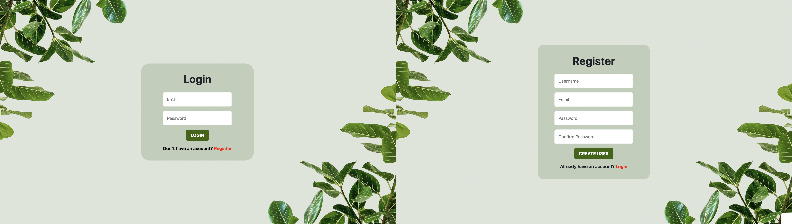
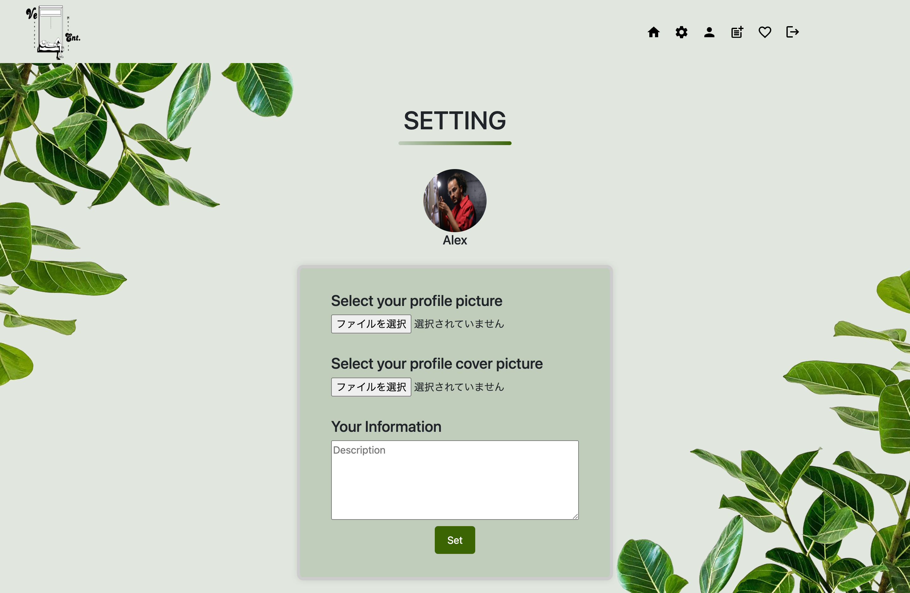

 

# SNS-app
 
 

## Home

 
 

## Login / Register

## Profile page

## Setting page

## post page

 

# DESCRIPTION
## ABOUT THE PROJECT

This app is a social media platform. It features a minimalist design with predominantly green elements, as shown in the image. This is intended to create a sense of safety for users, encouraging them to freely express their thoughts.

 
 

## OBJECT OF THE PROJECT

This app allows anyone to easily create a blog and share their information, opinions, thoughts, and pictures with people all over the world."

 
 

## TARGET USERS

The target audience is composed of people who want to share their information, opinions, thoughts, and pictures.

 
 
 

# TECHNOLOGIES 

 
・ JavaScript 
・ Node.js 
・ React.js 
・ MongoDB 
・ CSS 

 
 

# REFERENCES
Pinterest 
https://www.pinterest.ca/ 

Unsplash 
https://unsplash.com/ 

Color-picker 
https://imagecolorpicker.com/ 

Material-Icons 
https://mui.com/material-ui/material-icons/ 

React-bootstrap 
https://react-bootstrap.netlify.app/ 
